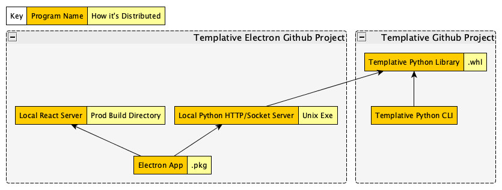

# Development

- `npm install`

## How to Get a Standalone package

templative -> build a whl file -> python server installs whl file -> pyinstaller packages python and pip dependencies in a all-in-one python server file
react build a production server
electron forge packages both servers into the resources included with the electron pkg
node code running teh electron app spins up both servers locally to serve react and templative stuff
the user doesnt need to install the templative electron app, python, node, or etc



## Loading Templative Changes

- Go to templative, run `pip install -e .`. Without this, images aren't included.
- Go to templative electron `npm run python-build`

## Running Production React Server

```
npm run react-build
npm install -g serve
serve -s build
```

## Launch React

- `npm react`

## Server

- `cd python`
- `pipenv install`
- `pipenv run python app.py`

## Launch All

- `npm run electron`

# Outputing

- `npm run exe`
- Check the `./out` folder
- Run `./out/templative-frontend-darwin-x64/templative-frontend.app/Contents/MacOS/templative-frontend`

# Clean dev env

## Removing installed packages
- `npm ls -gp --depth=0 | awk -F/ '/node_modules/ && !/\/npm$/ {print $NF}' | sudo xargs npm -g rm`
- `pip freeze | cut -d "@" -f1 | xargs pip uninstall -y`

## Remove stuff at port

- `lsof -i tcp:3000`
- `lsof -i tcp:8085`
- `kill PID`

templative = {file = "file:///C:/Users/User/Documents/git/nextdaygames/templative"}